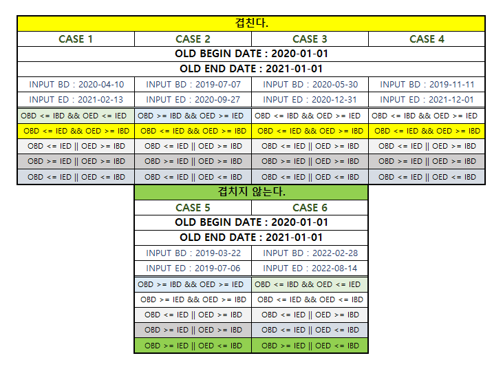

기존 구간이 `2020-01-01~2021-01-01` 까지라고 가정했을 때 일어날 수 있는 모든 케이스   
즉 크게는 `겹친다` `겹치지 않는다`로 분류하고   
각 항목에서 일어날 수 있는 `모든 케이스`들을 나열하고   
이들을 하나의 쿼리로 나타내기 위해 여러 비교 연산자들을 이용하여 테스트를 진행하였다.   



겹치는 구간에 한정하여 한가지의 공통점을 발견할 수 있었는데,   
새로 입력하는 구간의 시작일보다 기존 구간 종료일이 `같거나 이후의 날짜`에 해당하고 (AND)   
새로 입력하는 구간의 종료일보다 기존 구간 시작일이 `같거나 이전의 날짜`에 해당하는것을 확인 할 수 있다.   
이는 집합과 같은 개념을 생각하면 좀 더 쉽게 접근이 가능하다.   


아래 쿼리는 예시 (마리아db & 오라클) 이며 실제 날짜값을 입력하면 비교 가능하다.
```sql
-- MariaDB
SELECT OLD_BGN_DATE <= INPUT_END_DATE AND OLD_END_DATE >= INPUT_BGN_DATE FROM DUAL;
-- Oracle
SELECT CASE WHEN OLD_BGN_DATE <= INPUT_END_DATE AND OLD_END_DATE >= INPUT_BGN_DATE  THEN 1 ELSE 0 END FROM DUAL;
```